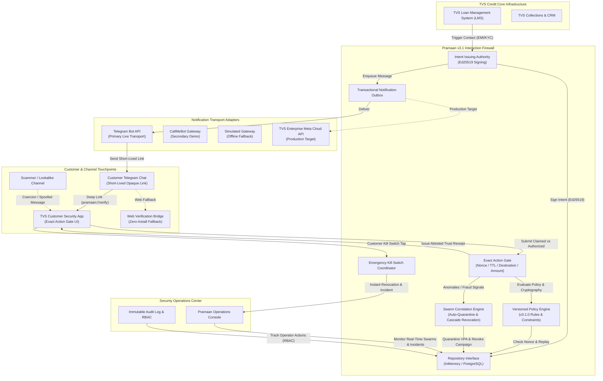

# PRAMAAN v3.1 — System Architecture

## Executive Overview

**Pramaan** is a financial interaction trust firewall designed for NBFCs and lending institutions like TVS Credit. 

### Core Product Principle
> **"Authenticate the interaction. Not the caller."**  
> Any channel (WhatsApp, Telegram, SMS, voice call, physical agent) may communicate with the customer; **only a TVS-authorized cryptographic intent can authorize the exact financial action.**

---

## 1. High-Level System Architecture

---

## 2. Core Architectural Subsystems

### 2.1 Capability-Based Intent Issuance
Instead of sending sensitive transaction authorizations over untrusted messaging channels, TVS LMS requests a short-lived capability intent:
- **Binding Attributes:** `customer_id`, `loan_id`, `purpose`, `action`, `amount`, `destination` (authorized VPA), `channel`, `partner_id`, `agent_id`, `nonce`, `expires_at`, `audience`, `session_id`.
- **Cryptographic Signature:** The canonical JSON serialization is signed with TVS Credit's active Ed25519 private key.
- **Payload Minimization:** The external notification carries only an opaque short-lived link or minimum required reference. Sensitive internal customer records remain inside the secure backend.

### 2.2 Transactional Notification Outbox
Decouples intent generation and customer verification from transport provider latency:
1. Intent persistence and outbox event creation execute in a single atomic repository transaction.
2. An asynchronous worker delivers notifications with exponential backoff and retry.
3. If an external transport (e.g. Telegram or Meta WhatsApp) experiences network partitions, customer in-app verification is unaffected.

### 2.3 Exact Action Gate & Versioned Policy Engine
When a borrower taps "Verify Securely", the Android application presents the incoming claim to the gate:
- **Cryptographic Verification:** Validates Ed25519 signature against active and verification-only public keys.
- **Freshness Gate:** Enforces real-time 180s Time-To-Live (TTL).
- **Replay Interception:** Rejects previously consumed nonces deterministically.
- **Exact Binding Match:** Compares claimed amount and destination against authoritative signed intent.
- **Versioned Policy Evaluation:** Evaluates rules against `v3.1.0` policy object, returning a versioned decision and reason code (`POL_AUTHORIZED`, `POL_MISMATCH_DESTINATION`, `POL_REPLAY_DETECTED`, etc.).

### 2.4 Persistent State Abstraction (Repository Pattern)
Engine storage is cleanly separated behind the `AbstractRepository` interface:
- **`InMemoryRepository`:** Fully self-contained, thread-safe memory store for deterministic automated testing and standalone zero-dependency demonstrations.
- **`PostgreSQLRepository`:** Enterprise production path with full DDL migrations, connection pooling, prepared statements, and transaction semantics.

### 2.5 Swarm Correlation & Coordinated Fraud Defense
A rogue recovery agent or organized scam ring often attempts multiple simultaneous diversions to a single mule account:
- When anomalous verifications cluster around a single unauthorized destination within a 15-minute sliding window, the Swarm Engine auto-quarantines the destination VPA across the entire TVS network.
- Automatically revokes all active in-flight intents targeting that destination (cascade revocation).

### 2.6 Emergency Customer Kill Switch
Empowers the borrower with immediate unilateral protection:
- Tapping **"I DON'T TRUST THIS REQUEST"** immediately revokes the active capability intent, flags the reported destination, records a critical fraud incident, generates an attested Trust Receipt, and alerts the Operations Console.

---

## 3. Pluggable Transport Subsystem

| Transport | Role | Operational State | Security Controls |
| :--- | :--- | :--- | :--- |
| **Telegram Bot API** | **Primary Live Transport** | Active in Demo & Field Pilots | Random single-use pairing tokens (`PAIR_<token>`), webhook secret token validation, update idempotency |
| **CallMeBot** | **Secondary Transport** | Retained fallback | API key authentication via environment variable |
| **Mock Transport** | **Offline Fallback** | Active when offline | In-memory log simulation |
| **TVS WhatsApp Business API** | **Production Target** | Specification Complete | Meta Cloud API with DLT template pre-registration and India-resident webhook termination |

---

## 4. Mobile Android Client Architecture
- **Framework:** Modern Android Jetpack Compose + Material 3.
- **Security Mindset:** Customer-centric UI. Technical cryptographic jargon is suppressed on primary screens; the customer sees:
  - Protection Status Badge
  - Active TVS Interaction Card
  - Primary "Verify Securely" CTA
  - Verified Details Breakdown (Authorized VPA, EMI amount, genuine agent name)
  - Clear "Allow", "Block", and "Emergency Kill Switch" CTAs
- **Deep Link Routing:** Handles `pramaan://verify?token=...` directly from messaging apps.
