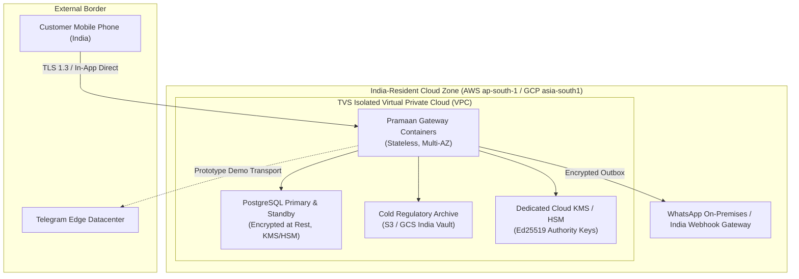

# PRAMAAN v3.1 — Data Residency, Privacy & Payload Minimization Architecture

## 1. Regulatory Context & Engineering Philosophy

Lending institutions in India are subject to the **Digital Personal Data Protection (DPDP) Act, 2023** and **Reserve Bank of India (RBI) Master Directions on Digital Lending**. 

Pramaan incorporates **Data Minimization by Design**:
1. **Zero Unnecessary PII on External Channels:** External notification networks (WhatsApp, Telegram, SMS) must never be treated as secure enclaves.
2. **Authoritative State Isolation:** Detailed customer loan balances, bank details, and personal identifiers remain strictly inside the TVS Credit India-resident core network.
3. **Opaque Short-Lived References:** Customer notification messages carry only short-lived capability tokens or minimal interaction context.

> [!NOTE]
> **Regulatory Claim Discipline:**  
> This document specifies the technical architecture designed to align with DPDP and RBI guidelines. It does not constitute formal legal or regulatory certification until formally audited by TVS Credit compliance officers.

---

## 2. Payload Minimization in External Transports

### 2.1 What Goes Over the Wire (Telegram / WhatsApp)
When Pramaan delivers an outbound notification:
- **Included:**
  - Brief customer first name (greeting)
  - Action summary (e.g. "EMI Payment Authorization Required")
  - Opaque short-lived verification token inside deep link: `pramaan://verify?token=eyJhY3Rpb24i...`
  - Explicit TTL notice (e.g. "Valid for 3 minutes")
- **Explicitly Excluded / Redacted from External Payload:**
  - Full Aadhaar / PAN numbers
  - Complete Bank Account numbers
  - Customer home address or credit score
  - Internal TVS credit underwriting risk parameters

### 2.2 Independent Public Trust Receipt Privacy (P2-19)
When third parties or borrowers independently verify a Trust Receipt via `/receipts/verify/{receipt_id}`:
- **Masked Data:** `customer_id` is cryptographically masked (e.g. `CU***01`).
- **Exposed Data:** Cryptographic verification status (`valid: true`), interaction reference, timestamp, verified action, authorized amount, and TVS authority key identifier.
- **Privacy Outcome:** Receipt validity can be proven publicly without leaking the borrower's identity or financial status.

---

## 3. Sovereign India Data Residency Architecture

### Technical Residency Guarantees:
1. **Geographic Localization:** All production database instances, cryptographic keys, and cold audit archives are pinned to India datacenters (`ap-south-1` Mumbai / `del` Delhi).
2. **Encryption at Rest:** AES-256 with customer-managed keys (CMEK) via India-resident Key Management Service (KMS) or Hardware Security Module (HSM).
3. **Encryption in Transit:** All API traffic strictly enforces TLS 1.3 with modern cipher suites (PFS).
4. **Transport Disassociation:** Telegram is utilized strictly as a field-prototype transport. Production roadmap specifies migration to enterprise WhatsApp Business API operating through India-resident gateways or direct SMS/In-App push notifications.
