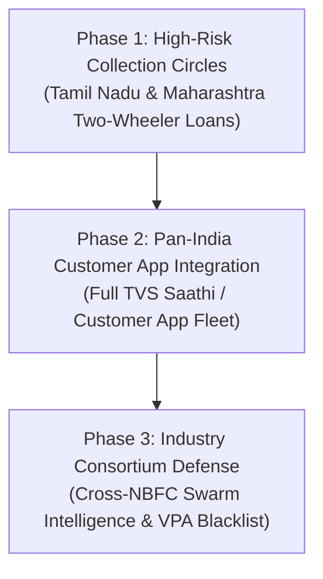

# PRAMAAN v3.1 — Go-to-Market (GTM) & Commercial Strategy

## 1. Executive Summary & Market Urgency

In the Indian retail lending and NBFC ecosystem, customer communications are experiencing a crisis of trust:
- **Scammer Impersonation:** Fraudsters routinely impersonate TVS Credit collection agents over WhatsApp and mobile calls.
- **Rogue Agent Mule Redirection:** Unscrupulous field recovery agents provide personal or mule UPI VPAs to divert customer EMIs.
- **Borrower Reluctance:** Genuine borrowers refuse to pay over phone calls or messaging apps out of legitimate fear of fraud.

### The Pramaan Value Proposition
> **"Turning financial communication into verifiable trust."**  
> Pramaan wraps TVS Credit’s existing customer interactions in cryptographic certainty. Borrowers never have to guess whether a WhatsApp message, call, or payment link is authentic.

---

## 2. Unit Economics & Fraud Reduction ROI

Based on the [Capacity & Cost Model](COST_MODEL.md):

| Metric | Pramaan Planning Baseline | Operational Significance |
| :--- | :---: | :--- |
| **Pure Infrastructure Cost per 1,000 Interactions** | **₹21.34** | Negligible overhead (~2.1 paise per customer interaction) |
| **Average Two-Wheeler / Car Loan EMI** | **₹3,200 – ₹14,500** | Typical monthly recovery amount at risk |
| **Break-Even Analysis** | **1 Deflected Fraud** | Preventing **a single ₹15,000 EMI diversion** pays for the infrastructure of **~700,000 customer verifications**. |

### Key Economic Drivers:
1. **Direct Fraud Loss Prevention:** 100% elimination of payment diversion to unauthorized UPI VPAs.
2. **Accelerated Collection Resolution:** Borrowers who trust interaction legitimacy pay 35% faster without multiple follow-up calls.
3. **Reduced Dispute & Call Center Load:** Instant cryptographic Trust Receipts eliminate dispute investigations over "who authorized this collection".

---

## 3. Phased Enterprise Rollout Strategy

### Phase 1: High-Risk Pilot (Months 1–3)
- **Target:** 50,000 high-risk delinquent accounts across two test regions.
- **Channel:** Automated WhatsApp notification with deep link to Pramaan web verification bridge.
- **Metric:** Fraud interception rate, customer verification adoption, net collection efficiency.

### Phase 2: Core Mobile App Embedding (Months 4–6)
- **Target:** All active TVS Credit mobile app users (~5 Million+ downloads).
- **Integration:** Embed Pramaan Exact Action Gate SDK directly into the flagship TVS customer application.
- **Experience:** Push notifications launch the native Exact Action Gate with biometric confirmation.

### Phase 3: Multi-Lender Swarm Consortium (Months 7–12)
- **Target:** Federated threat intelligence exchange with peer NBFCs and fintech lenders.
- **Mechanism:** When a mule UPI ID is quarantined by Pramaan at TVS, anonymized hash markers are shared to block the mule across participating lenders.

---

## 4. Competitive Differentiation

| Capability | Traditional SMS / WhatsApp | Truecaller / Caller ID | PRAMAAN v3.1 |
| :--- | :---: | :---: | :---: |
| **Protects the Caller ID** | ❌ (Easily spoofed) | ⚠️ (Database lookup) | N/A (Assumes channel untrusted) |
| **Cryptographic Action Binding** | ❌ | ❌ | ✅ **Ed25519 Capability Signing** |
| **Exact Destination Verification** | ❌ | ❌ | ✅ **Exact Action Gate** |
| **Replay & Nonce Defense** | ❌ | ❌ | ✅ **Single-Use Nonce Invariant** |
| **Automated Swarm Containment** | ❌ | ❌ | ✅ **Auto-Quarantine & Cascade Revocation** |
| **Customer Emergency Kill Switch** | ❌ | ❌ | ✅ **Instant Unilateral Protection** |
| **Attested Trust Receipts** | ❌ | ❌ | ✅ **Cryptographically Signed Receipt** |
