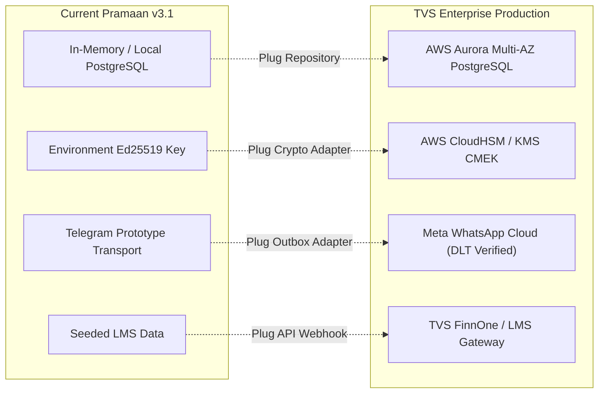

# PRAMAAN v3.1 — Production Gap Analysis & Maturity Matrix

## Engineering Claim Discipline
> **Implemented != Production Deployed.**  
> Pramaan v3.1 is an enterprise-defensible, fully validated working prototype and reference implementation. It does **NOT** claim live TVS production integration, certified biometric accuracy, or production carrier agreements.

---

## 1. Feature Maturity Classification

Every capability in Pramaan is classified into one of three rigorous tiers:
1. **IMPLEMENTED & VALIDATED:** Fully functional code with automated test coverage and live demo execution.
2. **PILOT-READY (FIELD PROTOTYPE):** Operational for testing and staging with documented external dependencies.
3. **PROPOSED FOR PRODUCTION:** Architectural roadmap requirements necessary for enterprise core deployment.

| Subsystem / Capability | Current Status | Implemented Behavior | Production Gap / Next Steps |
| :--- | :---: | :--- | :--- |
| **Ed25519 Capability Signing** | `IMPLEMENTED & VALIDATED` | In-memory & env seed keys, canonical serialization, key rotation (`ACTIVE` -> `VERIFICATION_ONLY` -> `REVOKED`). | Deploy to Cloud HSM / AWS KMS with automated quarterly hardware key rotation. |
| **Exact Action Gate** | `IMPLEMENTED & VALIDATED` | Full binding: loan, customer, action, amount, destination VPA, agent, partner, TTL, nonce. | Integrate with live TVS core collection gateway (UPI Intent / BBPS). |
| **Swarm & Auto-Quarantine** | `IMPLEMENTED & VALIDATED` | Sliding window correlation (3+ events/15min), auto-quarantine, cascade intent revocation. | Stream events into TVS Enterprise SIEM (Splunk / QRadar / Microsoft Sentinel). |
| **Customer Kill Switch** | `IMPLEMENTED & VALIDATED` | Unilateral revocation, fraud incident generation, destination blacklisting, Trust Receipt. | Hook directly into TVS automated account freeze & fraud operations queues. |
| **State Storage Layer** | `IMPLEMENTED & VALIDATED` | Clean `AbstractRepository` pattern; `InMemoryRepository` for demos; `PostgreSQLRepository` with full DDL. | Provision production Managed PostgreSQL (Aurora / Cloud SQL) with read replicas and WAL archiving. |
| **Notification Transport** | `PILOT-READY (PROTOTYPE)` | Telegram Bot API primary with random single-use tokens; CallMeBot secondary; Mock offline. | Secure TVS-approved Meta WhatsApp Business API WABA accounts with pre-approved DLT templates. |
| **Operator Console & RBAC** | `IMPLEMENTED & VALIDATED` | Web console, 4-tier RBAC (`Viewer`, `Analyst`, `Operator`, `Admin`), audit logging of privileged acts. | Integrate with TVS corporate Identity Provider (Azure AD / Okta) via SAML 2.0 / OIDC. |
| **Inward Trust KYC AI** | `PILOT-READY (PROTOTYPE)` | Open-source research adapter (`prithivMLmods/open-deepfake-detection`) + Laplacian edge variance. | Replace with certified production biometric liveness vendor (ISO 30107-3 compliant). |
| **Android Application** | `IMPLEMENTED & VALIDATED` | Jetpack Compose + Material 3 TVS security customer app, deep-link handling, Exact Action Gate. | Enable Play Integrity API, Android Keystore hardware-backed keys, and Play Store release signing. |
| **TVS LMS Integration** | `PILOT-READY (MOCK/SEED)` | Seed accounts (`LOAN-4521`, `LOAN-8832`, `LOAN-1090`), agent/partner registry in store. | Connect to TVS FinnOne / LMS core banking via authenticated REST/gRPC webhooks. |

---

## 2. Infrastructure Gaps to Production Launch

---

## 3. Recommended 90-Day Enterprise Production Plan

1. **Days 1–30: Enterprise Infrastructure Setup**
   - Provision VPC, subnets, and PostgreSQL cluster in AWS `ap-south-1` (Mumbai).
   - Configure AWS KMS asymmetric key pair for Ed25519 signing.
   - Deploy Pramaan containers onto AWS ECS/Fargate behind Application Load Balancer.

2. **Days 31–60: Enterprise Integration**
   - Complete Meta WhatsApp Business verification with TVS DLT headers.
   - Connect TVS LMS collection events via secure webhook to `POST /intent/issue`.
   - Integrate Operations Console with TVS Okta/Azure AD SSO.

3. **Days 61–90: Penetration Testing & Pilot Launch**
   - Perform third-party Cert-In certified security audit.
   - Run 10,000-borrower controlled pilot in two collection circles.
   - Measure fraud deflection and collection resolution metrics.
