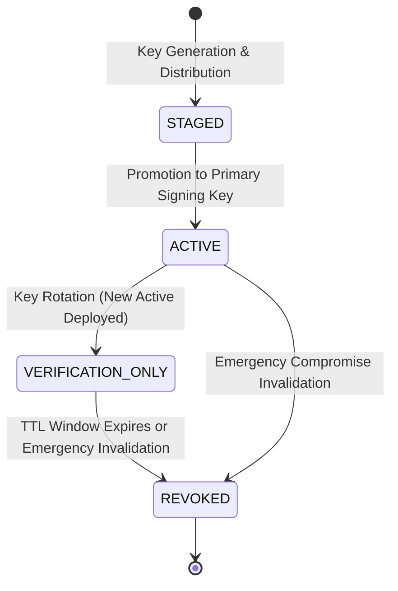

# PRAMAAN v3.1 — Security Model & Cryptographic Specification

## 1. Threat Model & Adversarial Assumptions

Pramaan operates under an adversarial zero-trust communication model. 

### Untrusted Channel Assumption
> **The messaging channel (WhatsApp, Telegram, SMS, phone call) is fundamentally unauthenticated and hostile.**  
> Attackers can spoof caller IDs, create verified-looking business accounts, forge display logos, or coerce borrowers over voice calls. Therefore, **channel identity is never used to authorize a financial transaction.**

### Primary Attack Vectors & Pramaan Mitigations

| Threat Vector | Attack Mechanism | Pramaan Defense | Outcome |
| :--- | :--- | :--- | :--- |
| **Fake Channel Attack** | Scammer sends lookalike notice requesting payment to personal UPI. | Exact Action Gate checks for valid TVS signature. No signed intent exists. | **UNVERIFIED / BLOCKED** |
| **Destination Diversion** | Rogue recovery agent presents genuine loan amount but substitutes mule UPI VPA. | Exact Action Gate compares claimed destination against signed `authorized_destination`. | **BLOCKED (POL_MISMATCH_DESTINATION)** |
| **Amount Tampering** | Scammer inflates collection amount to pocket difference. | Amount discrepancy detected during gate validation. | **BLOCKED (POL_MISMATCH_AMOUNT)** |
| **Capability Replay** | Attacker attempts to re-execute an already approved payment link. | Server-side consumed nonce registry checks unique nonce. | **BLOCKED (POL_REPLAY_DETECTED)** |
| **Payload Tampering** | Attacker alters token payload in transit (e.g. changing VPA). | Ed25519 cryptographic signature verification fails. | **BLOCKED (POL_INVALID_SIGNATURE)** |
| **Expired Intent Replay** | Attacker saves old payment link to reuse days later. | Freshness gate checks `expires_at` against UTC clock. | **BLOCKED (POL_EXPIRED_TTL)** |
| **Unauthorized Agent** | Suspended or rogue agent attempts to collect on behalf of TVS. | Policy Engine verifies agent status and allowed actions. | **BLOCKED (POL_UNAUTHORIZED_AGENT)** |
| **Coordinated Swarm** | Organized ring targets multiple borrowers directing funds to a single VPA. | Swarm Correlation Engine triggers auto-quarantine and cascade revocation. | **CONTAINED (POL_QUARANTINED_DESTINATION)** |
| **Deepfake Video KYC** | Synthetic identity or face-swap submitted during inward verification. | Edge-variance and spectral artifact heuristics flag anomaly. | **GATED & FLAGGED FOR REVIEW** |

---

## 2. Cryptographic Architecture

### 2.1 Ed25519 Asymmetric Signatures
Pramaan uses Edwards-curve Digital Signature Algorithm (Ed25519) over Curve25519:
- **Keys:** 32-byte public keys, 32-byte private seeds.
- **Performance:** Sub-millisecond signing (~90 µs) and verification (~215 µs), delivering over 4,500 verifications/second per core.
- **Canonical Serialization:** To prevent signature malleability caused by JSON whitespace or key ordering differences, payloads are serialized using strict canonical JSON:
  `json.dumps(payload, sort_keys=True, separators=(",", ":"))`

### 2.2 Key Rotation & Lifecycle Management
Authority keys undergo a 4-state lifecycle:

1. **ACTIVE:** Signs all newly issued intents and trust receipts.
2. **VERIFICATION_ONLY:** Former active key. Used strictly to verify tokens issued prior to rotation that are still inside their 180s TTL window. Cannot sign new tokens.
3. **REVOKED:** Inactive. Any capability token bearing a revoked `key_id` fails verification immediately.
4. **Public Key Discovery:** Public keys and their statuses are exposed via `GET /auth/keys` and `GET /auth/public-key`.

### 2.3 Single-Use Random Pairing Tokens
Telegram customer binding avoids predictable customer ID exposure:
- When a customer connects Telegram, Pramaan issues a short-lived token:
  `PAIR-<12_HEX_CHARS>` (e.g. `PAIR-8A3F12C9B04E`, 15-minute TTL).
- The pairing URL is generated as: `https://t.me/pramaan_demo_bot?start=PAIR_...`
- Upon arrival at `/telegram/webhook`, the token is atomically consumed and bound to the chat ID.
- Repeated attempts to use the same token are rejected with `PAIRING_TOKEN_INVALID`.

---

## 3. Operator Access & Role-Based Access Control (RBAC)

Pramaan enforces role-based access control across all administrative and console endpoints:

| Role | Permissions | Permitted Actions |
| :--- | :--- | :--- |
| **Viewer** | Read-only | View dashboard metrics, inspect active intent list, view public receipts |
| **Analyst** | Analysis & Telemetry | Export incident logs, view attack lab metrics, inspect anomaly logs |
| **Operator** | Incident Response | Revoke specific intent, trigger swarm quarantine, test simulator scenarios |
| **Admin** | Full Security Control | Rotate authority signing keys, configure policy rules, release quarantine |

### Audit Logging
All privileged operations generate immutable audit log entries:
- Recorded attributes: `operator_id`, `role`, `action`, `resource_id`, `details`, `timestamp`, `ip_address`.
- Accessible to security auditors via `GET /admin/audit-logs`.
- Production roadmap specifies SAML 2.0 / OIDC integration with TVS Credit Active Directory.

---

## 4. Idempotency & Delivery Guarantees
- **Guarantee:** `One Intent -> One Authorization Outcome -> One Trust Receipt`.
- When an Android client or network proxy retries verification with `idempotent: true`, the engine retrieves the existing Trust Receipt without re-consuming nonces or creating duplicate audit entries.
- If repeated authorization is attempted without `idempotent: true`, the consumed nonce intercepts the attempt as an unauthorized replay attack.
